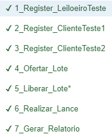

# PCS3643 - Laboratório de Engenharia de Software

O projeto da disciplina é um sistema para leilões online. Estamos em fase de implementação. Nesse README, temos

- Como executar o projeto localmente ?

- Screenshots

- O que tem na versão atual do projeto ?

- Quais testes foram implementados ?

- Referências e recursos importantes

## Como rodar localmente ?

### Banco de dados local

O projeto utiliza um banco MySQL local com as seguintes especificações **settings.py**.

>DATABASES = {
    'default': {
        'ENGINE': 'django.db.backends.mysql',
        'NAME': 'projetoleilao',
        'USER': 'nameuser',
        'PASSWORD': 'pass',
        'HOST': 'localhost',
        'PORT': '3306',
    }
}

 Para executar o projeto localmente é necessário criar esse database localmente e fornecer permissões ao user.

> CREATE DATABASE projetoleilao; 
> CREATE USER nameuser@localhost IDENTIFIED BY 'pass';
> GRANT ALL PRIVILEGES ON projetoleilao.* TO nameuser@localhost;
> FLUSH PRIVILEGES; 

### Subindo servidor Django

Com o banco de dados configurado, é necessário instalar o **pipenv**

> pip install pipenv

Então na pasta **ProjetoLeilao**, ativar o ambiente virtual

> pipenv shell

Realizar as migrações para deixar seu banco igual o nosso

> python manage.py migrate

Agora basta executar o servidor

> python manage.py runserver

## Pasta Screenshots

Para esclarecer o fluxo de usuário no projeto e criar uma memória visual do projeto, adicionamos uma pasta **Screenshots** contendo capturas de tela da versão atual do projeto em funcionamento.

## O que tem na versão atual do projeto ?

### Funcionalidades

- Signup de usuários Leiloeiros e Clientes

- Login e Logout de usuários

- Página exclusiva para usuário Leiloeiro

#### Para usuário cliente

- Ofertar lote de produto (vendedor paga taxa de comissão)

- Realizar lance em lote de produto (saldo de compradores e vendedores envolvidos é atualizado) 

- Atualizar saldo bancário

- Conferir saldo bancário

#### Para usuário Leiloeiro

- Gerar Relatórios

- Liberar Lote para leilão

OBS: as cobranças são realizadas no momento da realização do lance, portanto na versão atual mesmo se o maior lance for inferior ao valor de reserva o leilão é finalizado!

### Quais testes foram implementados ?

A pasta de testes, incluindo todos os arquivos de teste, possui caminho **ProjetoLeilao/app/tests**.

#### test_models.py

Foi implementado o arquivo ***test_models.py*** que realiza testes unitários sobre os models ***Lote***, ***Saldo*** e ***Pagamento***.

O pacote ***TestCase*** do Django cria um banco de dados teste. Portanto, ***antes de executar testes*** é necessário fornecer permissão para o user definido em ***settings.py*** acessar o banco de dados de teste:

> GRANT ALL PRIVILEGES ON test_projetoleilao.* TO nameuser@localhost;
> FLUSH PRIVILEGES; 

O comando para executar os testes montados é:

> python manage.py test app.tests

#### Selenium IDE

Na aula 9, foram realizados testes para a interface com o usuário utilizando a **Selenium IDE** para o navegador **Google Chrome**. O projeto se encontra no arquivo ***ProjetoLeilao.side***.

Os casos de teste realizados estão listados abaixo. É importante utilizar o comando

> python manage.py flush

antes de realizar os testes para limpar todas as tabelas do banco de dados. Também é necessário subir o servidor Django antes de executar os testes com o comando

> python manage.py runserver

Observação: é importante realizar os testes ***na ordem listada***, uma vez que, por exemplo, é importante ter o usuário cadastrado para fazer login.

- ***1_Cadastro_LeiloeiroTeste***: Cadastro de usuário do tipo leiloeiro com username LeiloeiroTeste.
  
- ***2_Cadastro_ClienteTeste1***: Cadastro de usuário do tipo cliente com username ClienteTeste1. 

- ***2_Cadastro_ClienteTeste2***: Cadastro de usuário do tipo cliente com username ClienteTeste2.

- ***4_Ofertar_Lote***: ClienteTeste1 oferta lote um lote de produto.
  
- ***5_Liberar_Lote***: LeiloeiroTeste libera lote para lances.

- ***6_Realizar_Lance***: ClienteTeste2 realiza lance no lote ofertado.

- ***7_Gerar_Relatorio***: LeiloeiroTeste teste gera relatório contendo taxas de comissão pagas.  

## Referências e recursos importantes

- Livro **Django for Beginners, William S. Vincent**

- [User Authentication in Django](https://docs.djangoproject.com/en/3.2/topics/auth/)

- [How to raise form validation errors](https://docs.djangoproject.com/en/dev/topics/forms/modelforms/#overriding-the-clean-method)

- [Linking user model to a custom profile model](https://prog.world/one-to-one-relationship-linking-a-user-model-to-a-custom-profile-model-in-django/)

- [Making database queries in Django](https://docs.djangoproject.com/en/3.2/topics/db/queries/)
