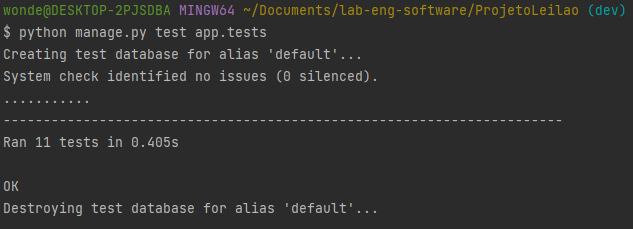

# PCS3643 - Laboratório de Engenharia de Software

O projeto da disciplina é um sistema para leilões online. Estamos em fase de implementação. Nesse README, temos

- Como executar o projeto localmente ?

- Screenshots

- O que tem na versão atual do projeto ?

- Quais testes foram implementados ?

- Referências e recursos importantes

## Como rodar localmente ?

### Banco de dados local

O projeto utiliza um banco MySQL local com as seguintes especificações **settings.py**.

>DATABASES = {
    'default': {
        'ENGINE': 'django.db.backends.mysql',
        'NAME': 'projetoleilao',
        'USER': 'nameuser',
        'PASSWORD': 'pass',
        'HOST': 'localhost',
        'PORT': '3306',
    }
}

 Para executar o projeto localmente é necessário criar esse database localmente e fornecer permissões ao user.

> CREATE DATABASE nomeDB; 
> CREATE USER nameuser@localhost IDENTIFIED BY 'pass';
> GRANT ALL PRIVILEGES ON nomeDB.* TO nameuser@localhost;
> FLUSH PRIVILEGES; 

### Subindo servidor Django

Com o banco de dados configurado, é necessário instalar o **pipenv**

> pip install pipenv

Então na pasta **ProjetoLeilao**, ativar o ambiente virtual

> pipenv shell

Realizar as migrações para deixar seu banco igual o nosso

> python manage.py migrate

Agora basta executar o servidor

> python manage.py runserver

## Pasta Screenshots

Para esclarecer o fluxo de usuário no projeto e criar uma memória visual do projeto, adicionamos uma pasta **Screenshots** contendo capturas de tela da versão atual do projeto em funcionamento.

## O que tem na versão atual do projeto ?

### Funcionalidades

- Signup de usuários Leiloeiros e Clientes

- Login e Logout de usuários

- Página exclusiva para usuário Leiloeiro

- Ofertar lote de produto (apenas para usuário Cliente!!)

- Realizar lance em lote de produto (apenas para usuário Cliente!!)

> Lances abaixo do maior lance atual são rejeitados !

***O caso de uso Ofertar Lotes de Produto está completamente implementado!***

### Quais testes foram implementados ?

Foi implementado o arquivo ***test_models.py*** que realiza testes unitários sobre o model ***Lote***.

O pacote ***TestCase*** do Django cria um banco de dados teste.

Portanto, ***antes de executar testes*** é necessário fornecer permissão para o user definido em ***settings.py*** acessar o banco de dados de teste:

> GRANT ALL PRIVILEGES ON test_projetoleilao.* TO nameuser@localhost;
> FLUSH PRIVILEGES; 

O comando para executar os testes montados é:

> python manage.py test app.tests

Segue screenshot com a saída dos testes executados:

## Referências e recursos importantes

- Livro **Django for Beginners, William S. Vincent**

- [User Authentication in Django](https://docs.djangoproject.com/en/3.2/topics/auth/)

- [How to raise form validation errors](https://docs.djangoproject.com/en/dev/topics/forms/modelforms/#overriding-the-clean-method)

- [How to output PDFs in Django](https://docs.djangoproject.com/en/3.2/howto/outputting-pdf/)